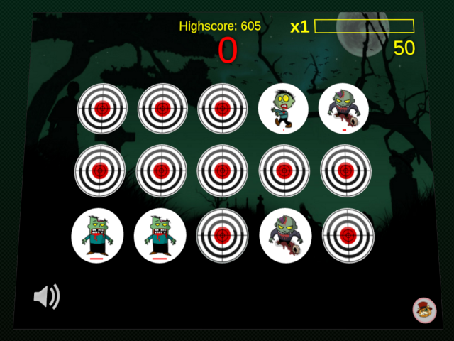

Hit the Zombie
====================

Description
---------------------
This is a simple html game written in Dart. Click on every target before it closes to survive.
The game was created mainly for practice.

Screenshots
---------------------
  
  

How to run
---------------------

### Locally
`mvn clean install jetty:run`

open http://localhost:8080

### Docker

You can run a prebuilt image using the command below to run this in docker 
`docker run -d --restart=always -p 8080:8080 --name=hit-the-zombie mborkunov/hit-the-zombie`